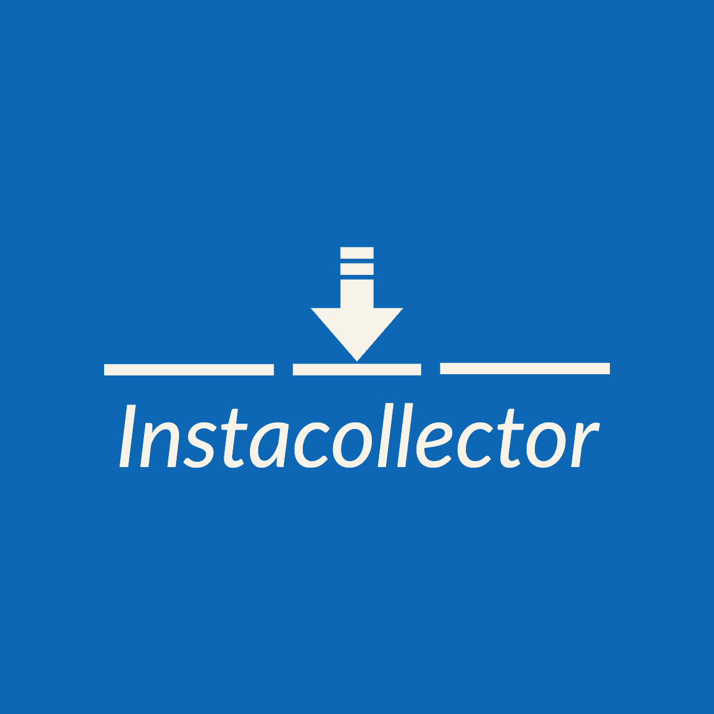

Disclaimer: This program is not affiliated with, endorsed by, or in any way associated with Instagram.



# InstaCollector Bulk Downloader

This script (bulk version) allows users to download posts from an Instagram profile and it will organize them into folders based on file formats.

## Usage:

- Enter the Instagram profile URL and the target folder name for downloads.

- Specify the number of posts to download (default: all).

- The script will download the posts and organize them into folders based on file formats.

- Optionally, the script can delete JSON and TXT files from the target directory.

## Dependencies:
- instaloader: Python library to download Instagram posts.
- tqdm: Python library for progress bars.
- colorama: Python library for colored terminal output.

## Installation:

To install the required dependencies for the Instagram Post Downloader script, follow the steps below:

1. Open your terminal.

2. Install instaloader by running the following command:

```
$ pip3 install instaloader
```

3. Install tqdm by running the following command:

```
$ pip3 install tqdm
```

4. Install colorama by running the following command:

```
$ pip3 install colorama
```

## Authors

- [@2b12WNu4tpUF7CL4ua79z6QtxePjM9zgxgBO404](https://github.com/2b12WNu4tpUF7CL4ua79z6QtxePjM9zgxgBO404)


